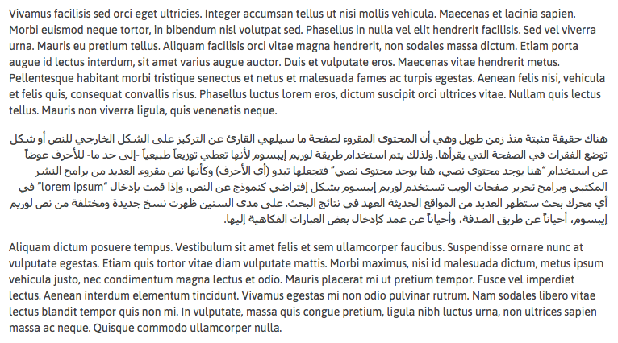

# field-bidi
A field method for the excellent [Kirby CMS](http://github.com/getkirby) for the proper alignment of bi-directional text.

## What?

If you set the `dir="auto"` attribute on block-level elements, browsers will detect the proper text direction based on what unicode characters are inside the element.

This is useful when writing bi-directional content, for example a blog post with a mix of Latin and Arabic text.

**<mark>field-bidi automatically adds these direction attributes to your markup so you don't have to do it manually.</mark>**



## Install

### With git

Install this plugin as a git submodule to make updates and version control easy.

```
cd your/kirby/root
git submodule add https://github.com/samnabi/field-bidi.git site/plugins/field-bidi
```

### Without git

Otherwise, just download this repo and drop the whole `field-bidi` folder into your `site/plugins` folder.

## How to use

You can chain this field method to the end of any `markdown()` or `kirbytext()` method, like this:

```
// Outputs <p>Lorem ipsum</p>
<?php echo $text->kirbytext() ?>

// Outputs <p dir="auto">Lorem ipsum</p>
<?php echo $text->kirbytext()->bidi() ?>
```