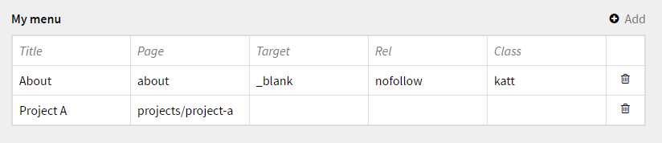
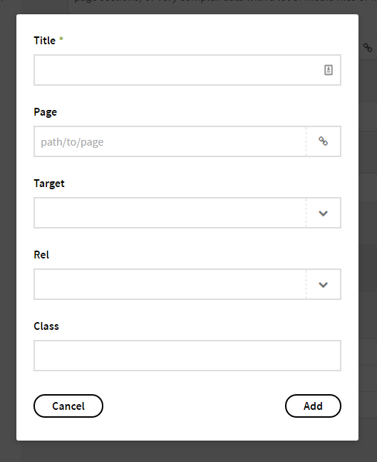

# Kirby Menu Editor

*Version 0.2*

A menu editor for simple menus.

**In short**

- You can't make sublevel menus with it.
- It does not support every `target` and every `rel` value, only the most important ones.
- It does come with different setups depending on what kind of menu you need.





## Installation

Use one of the alternatives below.

### 1. Kirby CLI

If you are using the [Kirby CLI](https://github.com/getkirby/cli) you can install this plugin by running the following commands in your shell:

```
$ cd path/to/kirby
$ kirby plugin:install jenstornell/kirby-menu-editor
```

### 2. Clone or download

1. [Clone](https://github.com/jenstornell/kirby-menu-editor.git) or [download](https://github.com/jenstornell/kirby-menu-editor/archive/master.zip)  this repository.
2. Unzip the archive if needed and rename the folder to `kirby-menu-editor`.

**Make sure that the plugin folder structure looks like this:**

```
site/plugins/kirby-menu-editor/
```

### 3. Git Submodule

If you know your way around Git, you can download this plugin as a submodule:

```
$ cd path/to/kirby
$ git submodule add https://github.com/jenstornell/kirby-menu-editor site/plugins/kirby-menu-editor
```

## Setup

### Blueprint

To make it work as expected, add the following code to your blueprint:

```
fields:
  my_menu:
    label: My menu
    extends: menu_default
```

There are more setups than just `menu_default` that you can use. See below for more information.

### Extends: `menu_default`

- Title
- Page
- Target
- Rel
- Class

### Extends: `menu_minimal`

- Title
- Page

### Extends: `menu_full`

- Image
- Title
- Description
- Page
- Target
- Rel
- Class

I recommend to add the blueprint field into the `site.yml` because menus are often global.

## Usage

### Panel

See the screenshots in the beginning.

The menu editor is a structure field and works the same way. You can set `target`, `rel` and `class` but it's not required.

### Snippet

The most simple way you can use this is by adding this snippet to your code:

```php
snippet('menueditor', array('page' => $page, 'field' => 'my_menu'));
```

It's possible to override this snippet with your own snippet by calling it the same name and putting in into your snippet folder.

### Custom use

If you don't want to use the snippet and don't want to override it you can add something like this to your template:

```php
<?php foreach( $page->{$field}()->toStructure() as $item ) : ?>
<?php $attributes = menuEditorAttributes($item); ?>
    <li>
      <a href="<?php echo page( $item->page() )->url(); ?>"<?php echo $attributes; ?>><?php echo $item->title(); ?></a>
    </li>
<?php endforeach;
```

`menuEditorAttributes` is a helper function to get the html part of the attributes for a more clean template/snippet.

## Changelog

**0.2**

- Bug fixes in snippet approach
- Updated snippet syntax where field value is required
- Blueprint change
- Added default, minimal and full blueprint field definitions for different kinds of menus

**0.1**

- Initial release 

## Requirements

- [**Kirby**](https://getkirby.com/) 2.3+

## Disclaimer

This plugin is provided "as is" with no guarantee. Use it at your own risk and always test it yourself before using it in a production environment. If you find any issues, please [create a new issue](https://github.com/jenstornell/kirby-menu-editor/issues/new).

## License

[MIT](https://opensource.org/licenses/MIT)

It is discouraged to use this plugin in any project that promotes racism, sexism, homophobia, animal abuse, violence or any other form of hate speech.

## Credits

- [Jens Törnell](https://github.com/jenstornell)